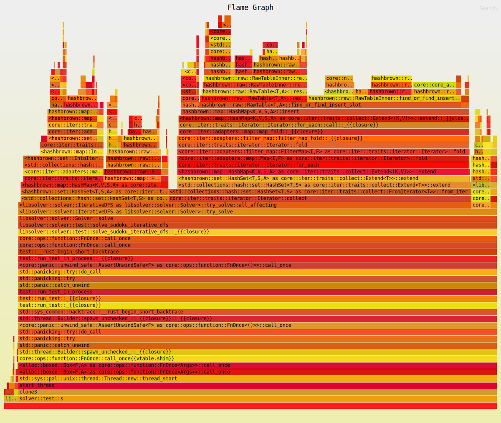

# Performance log

Log of the performance of this crate.

## Commit fd7a0574 (06.04.2024)

### Main binary

```console
$ head $SUDOKU17| cargo run --quiet --release -- -
[INFO]: Reading the file took 0.001ms
[INFO]: Parsing the 10 Sudokus took 0.002ms
        that is 0.247us per sudoku
[INFO]: Total time 0.000010699s
[INFO]: Solved 10 sudokus in 136.536s, that is 13653.594ms per sudoku
```

### iai benchmarks

```
dfs_iai::solve_sudoku_group::solve_sudoku first:Sudoku :: from_line(SUDOKU)
  Instructions:          5649147937
  L1 Hits:               6887022124
  L2 Hits:                       13
  RAM Hits:                     216
  Total read+write:      6887022353
  Estimated Cycles:      6887029749
```

### Flamegraph

Generated using `cargo flamegraph --unit-test libsolver -- solver::test::solve_sudoku_iterative_dfs`


