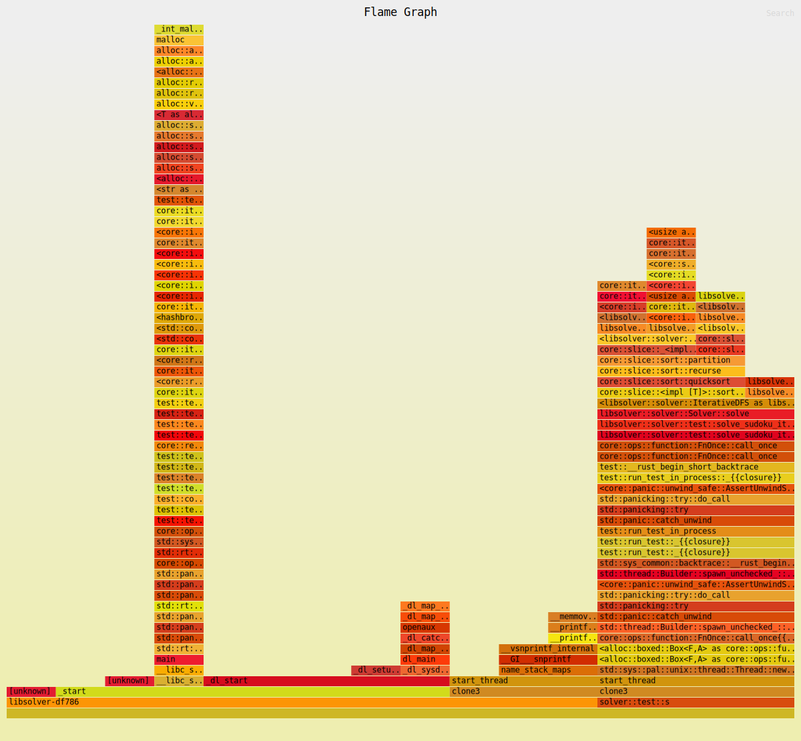
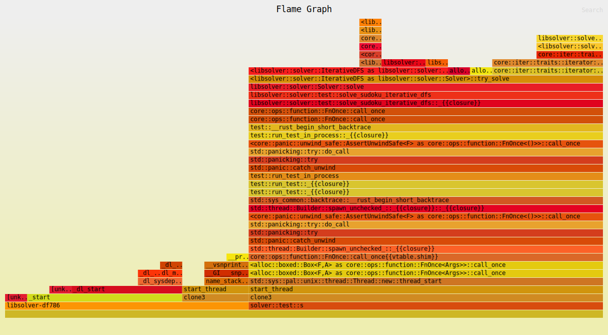
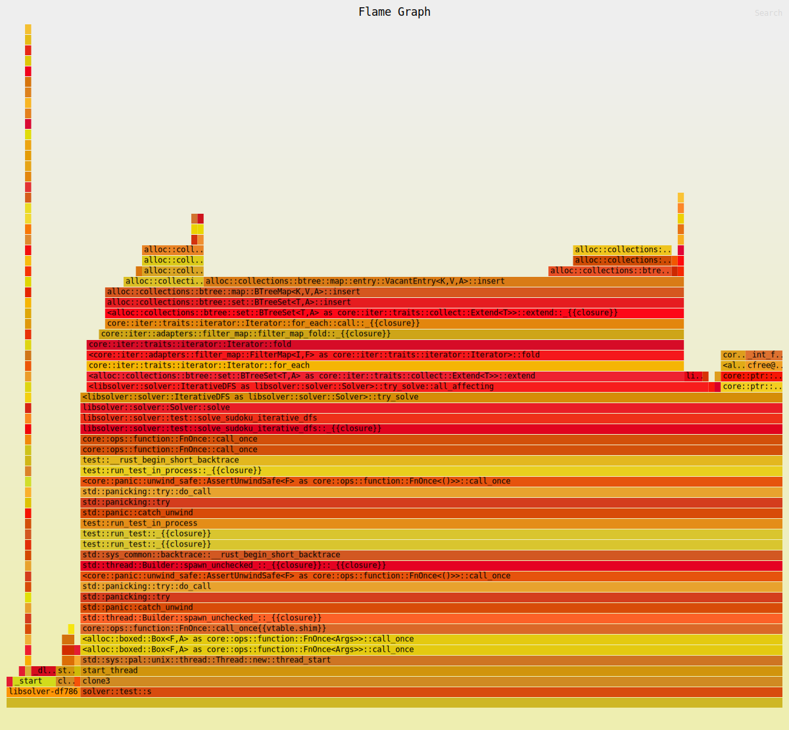
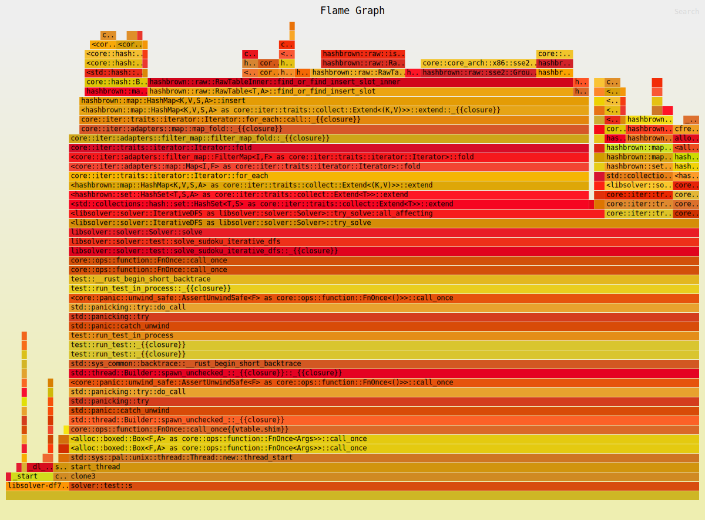
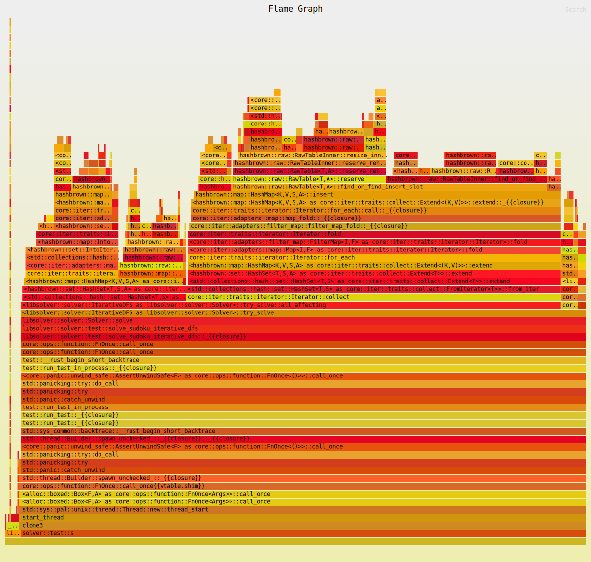

# Performance log of the solver

This log is autogenerated from [analysis/perf_report.py] and the templates in [analysis/templates]. It records how the performance of the solver has evolved over time.

## Commit 68ae094f

<!--- What changed in this commit? -->

### Benchmark results

- Solve 10
- iai
- flamegraph

#### Solve 10

```console
$ head $SUDOKU17 | cargo run --quiet --release -- -
[INFO]: Reading the file took 0.001ms
[INFO]: Parsing the 10 Sudokus took 0.002ms
        that is 0.207us per sudoku
[INFO]: Total time 0.000010339s
[INFO]: Solved 10 sudokus in 0.062s, that is 6.162ms per sudoku
```

#### iai

Generated using `cargo bench`

<!--- FIXME: figure out how to include results -->
```
Callgrind, a call-graph generating cache profiler
Copyright (C) 2002-2017, and GNU GPL'd, by Josef Weidendorfer et al.
Using Valgrind-3.22.0 and LibVEX; rerun with -h for copyright info
Command: /tmp/bench._bdec7b_/target/release/deps/dfs_iai-6ca19a207c52434a --iai-run solve_sudoku_group 0 0 dfs_iai::solve_sudoku_group::solve_sudoku
Parent PID: 63973

--63976-- warning: L3 cache found, using its data for the LL simulation.
For interactive control, run 'callgrind_control -h'.

Events    : Ir Dr Dw I1mr D1mr D1mw ILmr DLmr DLmw
Collected : 11772512 1937524 759378 250 1 60 247 0 43

I   refs:      11,772,512
I1  misses:           250
LLi misses:           247
I1  miss rate:       0.00%
LLi miss rate:       0.00%

D   refs:       2,696,902  (1,937,524 rd + 759,378 wr)
D1  misses:            61  (        1 rd +      60 wr)
LLd misses:            43  (        0 rd +      43 wr)
D1  miss rate:        0.0% (      0.0%   +     0.0%  )
LLd miss rate:        0.0% (      0.0%   +     0.0%  )

LL refs:              311  (      251 rd +      60 wr)
LL misses:            290  (      247 rd +      43 wr)
LL miss rate:         0.0% (      0.0%   +     0.0%  )
```

#### flamegraph

Generated using `cargo flamegraph --unit-test libsolver -- solver::test::solve_sudoku_iterative_dfs`




## Commit c3d700c2

<!--- What changed in this commit? -->

### Benchmark results

- Solve 10
- iai
- flamegraph

#### Solve 10

```console
$ head $SUDOKU17 | cargo run --quiet --release -- -
[INFO]: Reading the file took 0.001ms
[INFO]: Parsing the 10 Sudokus took 0.002ms
        that is 0.212us per sudoku
[INFO]: Total time 0.00001088s
[INFO]: Solved 10 sudokus in 4.070s, that is 406.971ms per sudoku
```

#### iai

Generated using `cargo bench`

<!--- FIXME: figure out how to include results -->
```
Callgrind, a call-graph generating cache profiler
Copyright (C) 2002-2017, and GNU GPL'd, by Josef Weidendorfer et al.
Using Valgrind-3.22.0 and LibVEX; rerun with -h for copyright info
Command: /tmp/benchuj3n5lo1/target/release/deps/dfs_iai-6ca19a207c52434a --iai-run solve_sudoku_group 0 0 dfs_iai::solve_sudoku_group::solve_sudoku
Parent PID: 53886

--53889-- warning: L3 cache found, using its data for the LL simulation.
For interactive control, run 'callgrind_control -h'.

Events    : Ir Dr Dw I1mr D1mr D1mw ILmr DLmr DLmw
Collected : 256860348 33627552 19994028 124 1 48 122 0 43

I   refs:      256,860,348
I1  misses:            124
LLi misses:            122
I1  miss rate:        0.00%
LLi miss rate:        0.00%

D   refs:       53,621,580  (33,627,552 rd + 19,994,028 wr)
D1  misses:             49  (         1 rd +         48 wr)
LLd misses:             43  (         0 rd +         43 wr)
D1  miss rate:         0.0% (       0.0%   +        0.0%  )
LLd miss rate:         0.0% (       0.0%   +        0.0%  )

LL refs:               173  (       125 rd +         48 wr)
LL misses:             165  (       122 rd +         43 wr)
LL miss rate:          0.0% (       0.0%   +        0.0%  )
```

#### flamegraph

Generated using `cargo flamegraph --unit-test libsolver -- solver::test::solve_sudoku_iterative_dfs`




## Commit 04610b63

<!--- What changed in this commit? -->

### Benchmark results

- Solve 10
- iai
- flamegraph

#### Solve 10

```console
$ head $SUDOKU17 | cargo run --quiet --release -- -
[INFO]: Reading the file took 0.001ms
[INFO]: Parsing the 10 Sudokus took 0.002ms
        that is 0.218us per sudoku
[INFO]: Total time 0.000009408s
[INFO]: Solved 10 sudokus in 38.798s, that is 3879.802ms per sudoku
```

#### iai

Generated using `cargo bench`

<!--- FIXME: figure out how to include results -->
```
Callgrind, a call-graph generating cache profiler
Copyright (C) 2002-2017, and GNU GPL'd, by Josef Weidendorfer et al.
Using Valgrind-3.22.0 and LibVEX; rerun with -h for copyright info
Command: /tmp/benchuj3n5lo1/target/release/deps/dfs_iai-6ca19a207c52434a --iai-run solve_sudoku_group 0 0 dfs_iai::solve_sudoku_group::solve_sudoku
Parent PID: 53719

--53722-- warning: L3 cache found, using its data for the LL simulation.
For interactive control, run 'callgrind_control -h'.

Events    : Ir Dr Dw I1mr D1mr D1mw ILmr DLmr DLmw
Collected : 1639834389 290994520 193191239 155 1 48 152 0 43

I   refs:      1,639,834,389
I1  misses:              155
LLi misses:              152
I1  miss rate:          0.00%
LLi miss rate:          0.00%

D   refs:        484,185,759  (290,994,520 rd + 193,191,239 wr)
D1  misses:               49  (          1 rd +          48 wr)
LLd misses:               43  (          0 rd +          43 wr)
D1  miss rate:           0.0% (        0.0%   +         0.0%  )
LLd miss rate:           0.0% (        0.0%   +         0.0%  )

LL refs:                 204  (        156 rd +          48 wr)
LL misses:               195  (        152 rd +          43 wr)
LL miss rate:            0.0% (        0.0%   +         0.0%  )
```

#### flamegraph

Generated using `cargo flamegraph --unit-test libsolver -- solver::test::solve_sudoku_iterative_dfs`




## Commit 53f8f6cb

<!--- What changed in this commit? -->

### Benchmark results

- Solve 10
- iai
- flamegraph

#### Solve 10

```console
$ head $SUDOKU17 | cargo run --quiet --release -- -
[INFO]: Reading the file took 0.001ms
[INFO]: Parsing the 10 Sudokus took 0.002ms
        that is 0.225us per sudoku
[INFO]: Total time 0.000009247s
[INFO]: Solved 10 sudokus in 40.468s, that is 4046.837ms per sudoku
```

#### iai

Generated using `cargo bench`

<!--- FIXME: figure out how to include results -->
```
Callgrind, a call-graph generating cache profiler
Copyright (C) 2002-2017, and GNU GPL'd, by Josef Weidendorfer et al.
Using Valgrind-3.22.0 and LibVEX; rerun with -h for copyright info
Command: /tmp/benchuj3n5lo1/target/release/deps/dfs_iai-6ca19a207c52434a --iai-run solve_sudoku_group 0 0 dfs_iai::solve_sudoku_group::solve_sudoku
Parent PID: 53546

--53549-- warning: L3 cache found, using its data for the LL simulation.
For interactive control, run 'callgrind_control -h'.

Events    : Ir Dr Dw I1mr D1mr D1mw ILmr DLmr DLmw
Collected : 2116919003 228706942 119111850 140 2 50 140 0 44

I   refs:      2,116,919,003
I1  misses:              140
LLi misses:              140
I1  miss rate:          0.00%
LLi miss rate:          0.00%

D   refs:        347,818,792  (228,706,942 rd + 119,111,850 wr)
D1  misses:               52  (          2 rd +          50 wr)
LLd misses:               44  (          0 rd +          44 wr)
D1  miss rate:           0.0% (        0.0%   +         0.0%  )
LLd miss rate:           0.0% (        0.0%   +         0.0%  )

LL refs:                 192  (        142 rd +          50 wr)
LL misses:               184  (        140 rd +          44 wr)
LL miss rate:            0.0% (        0.0%   +         0.0%  )
```

#### flamegraph

Generated using `cargo flamegraph --unit-test libsolver -- solver::test::solve_sudoku_iterative_dfs`




## Commit fd7a0574

<!--- What changed in this commit? -->

### Benchmark results

- Solve 10
- iai
- flamegraph

#### Solve 10

```console
$ head $SUDOKU17 | cargo run --quiet --release -- -
[INFO]: Reading the file took 0.001ms
[INFO]: Parsing the 10 Sudokus took 0.002ms
        that is 0.219us per sudoku
[INFO]: Total time 0.000009418s
[INFO]: Solved 10 sudokus in 126.417s, that is 12641.678ms per sudoku
```

#### iai

Generated using `cargo bench`

<!--- FIXME: figure out how to include results -->
```
Callgrind, a call-graph generating cache profiler
Copyright (C) 2002-2017, and GNU GPL'd, by Josef Weidendorfer et al.
Using Valgrind-3.22.0 and LibVEX; rerun with -h for copyright info
Command: /tmp/benchuj3n5lo1/target/release/deps/dfs_iai-6ca19a207c52434a --iai-run solve_sudoku_group 0 0 dfs_iai::solve_sudoku_group::solve_sudoku
Parent PID: 53282

--53285-- warning: L3 cache found, using its data for the LL simulation.
For interactive control, run 'callgrind_control -h'.

Events    : Ir Dr Dw I1mr D1mr D1mw ILmr DLmr DLmw
Collected : 5649082023 765481335 472380948 169 4 54 169 0 47

I   refs:      5,649,082,023
I1  misses:              169
LLi misses:              169
I1  miss rate:          0.00%
LLi miss rate:          0.00%

D   refs:      1,237,862,283  (765,481,335 rd + 472,380,948 wr)
D1  misses:               58  (          4 rd +          54 wr)
LLd misses:               47  (          0 rd +          47 wr)
D1  miss rate:           0.0% (        0.0%   +         0.0%  )
LLd miss rate:           0.0% (        0.0%   +         0.0%  )

LL refs:                 227  (        173 rd +          54 wr)
LL misses:               216  (        169 rd +          47 wr)
LL miss rate:            0.0% (        0.0%   +         0.0%  )
```

#### flamegraph

Generated using `cargo flamegraph --unit-test libsolver -- solver::test::solve_sudoku_iterative_dfs`




